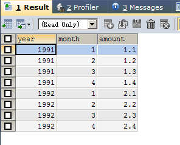
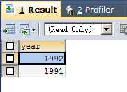
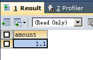
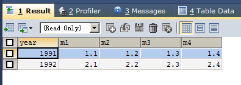

# 20171201 #

## 1、题目 ##


## 2、解决 ##

### 2.1、创建表添加数据 ###

```sql
DROP TABLE IF EXISTS `sales`;

CREATE TABLE `sales`(
    `year` INT NULL,
    `month` INT NULL,
    `amount` DOUBLE NULL
);

INSERT INTO `sales`(`year`,`month`,`amount`) VALUES(1991,1,1.1);
INSERT INTO `sales`(`year`,`month`,`amount`) VALUES(1991,2,1.2);
INSERT INTO `sales`(`year`,`month`,`amount`) VALUES(1991,3,1.3);
INSERT INTO `sales`(`year`,`month`,`amount`) VALUES(1991,4,1.4);
INSERT INTO `sales`(`year`,`month`,`amount`) VALUES(1992,1,2.1);
INSERT INTO `sales`(`year`,`month`,`amount`) VALUES(1992,2,2.2);
INSERT INTO `sales`(`year`,`month`,`amount`) VALUES(1992,3,2.3);
INSERT INTO `sales`(`year`,`month`,`amount`) VALUES(1992,4,2.4);

SELECT * FROM `sales`;

```



### 2.2、查询数据 ###

```sql
SELECT `year`
FROM `sales`
GROUP BY `year`
ORDER BY `year` DESC;
```



```sql
SELECT amount FROM `sales` WHERE `year` = 1991 AND `month` = 1
```



```sql
SELECT `year`,
       (SELECT amount FROM `sales` WHERE `year` = a.`year` AND `month` = 1) AS 'm1',
       (SELECT amount FROM `sales` WHERE `year` = a.`year` AND `month` = 2) AS 'm2',
       (SELECT amount FROM `sales` WHERE `year` = a.`year` AND `month` = 3) AS 'm3',
       (SELECT amount FROM `sales` WHERE `year` = a.`year` AND `month` = 4) AS 'm4'
FROM `sales` AS a
GROUP BY `year`
ORDER BY `year` ASC;
```



